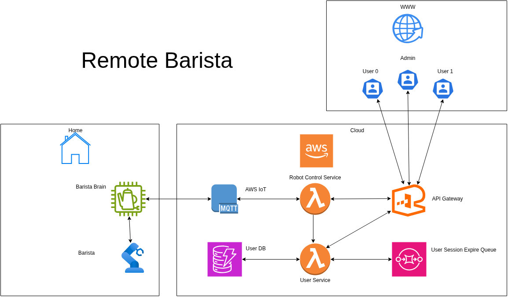

# System Architecture

## Overview

The platform to make your coffee remotely

## High-Level Architecture

## Components

### 1. API Layer
- Handles user requests
- Authentication
- Rate limiting

### 2. Application Layer
- Business logic
- Session management

### 3. Data Layer
- DynamoDB for session storage
- TTL for expiration

## Session Timeout Flow

1. User starts session
2. Session stored in DynamoDB
3. Expiration scheduled
4. Lambda triggered on expiration